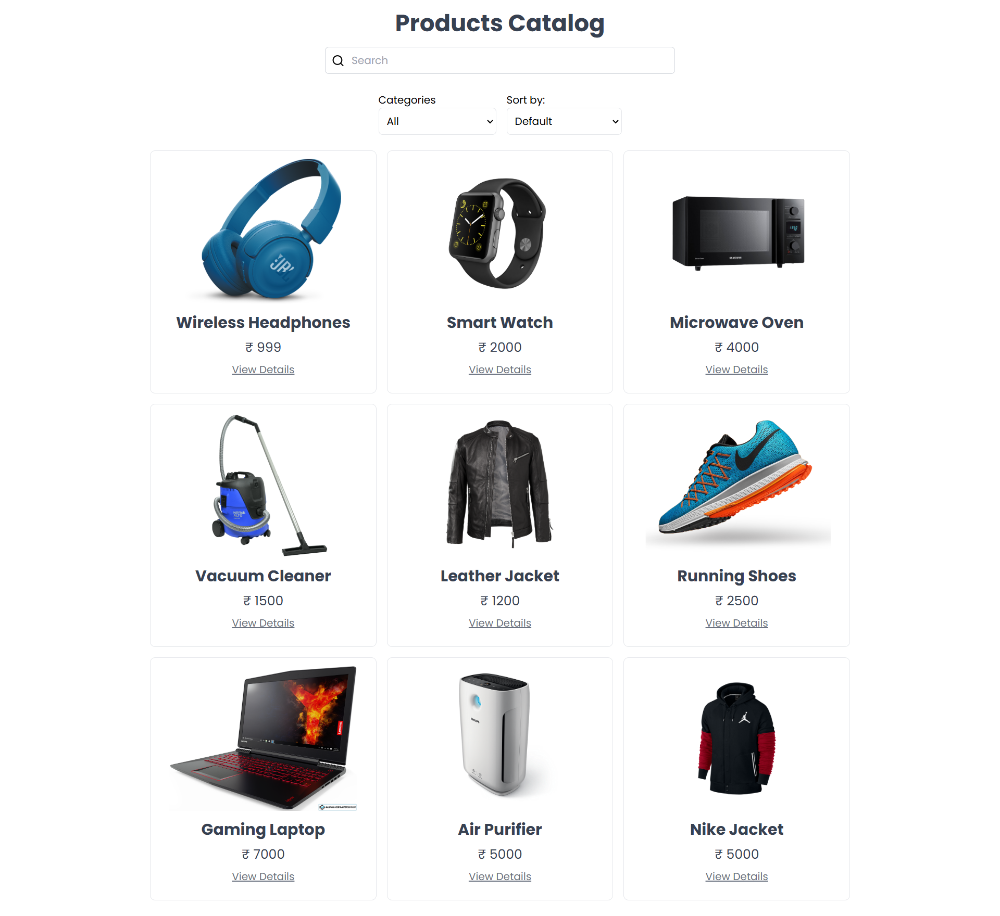

# React Product Catalog

This is a single-page application (SPA) that displays a product catalog. Users can view a list of products, filter them by category, search by name, and sort by price. The application includes optional enhancements such as sorting functionality and animations.

## Features
* View Products: Displays a list of products in a responsive grid layout.
* Filter by Category: Allows users to filter products by their categories.
* Search: Enables real-time search for products by name.
* Product Details: View detailed information about a selected product, including a description and image.
* Sorting: Sort products by price in ascending or descending order.
* Animations: Smooth animations enhance the user experience.
* Responsive Design: Optimized for desktops, tablets, and mobile devices.

## Installation and Setup
* Clone the repository:
    * git clone https://github.com/your-username/react-product-catalog.git
    * cd react-product-catalog

* Install dependencies: Make sure you have Node.js installed, then run:
    * npm install

* Run the application: Start the development server
    * npm run dev 

# Libraries and Tools Used
* Vite: Fast build tool for creating the React project.
* React Router: For routing between pages.
* React Icons: Used for the search icon in the input field.
* Tailwind CSS: For styling the application.

# Challenges Faced
* Implementing Sorting Functionality:

    * Challenge: Ensuring that sorting integrates seamlessly with filtering and search.
    * Solution: Managed the sort state (asc, desc, default) separately and dynamically sorted filtered results.

* Responsive Design:

    * Challenge: Maintaining a consistent layout across different screen sizes.
    * Solution: Used Tailwind CSS's responsive utilities (grid-cols-1, md:grid-cols-2, etc.) and media queries.

# Optional Enhancements Implemented
* Sorting: Added a dropdown to sort products by price (ascending or descending).
* Animations: Smooth transitions and hover effects enhance the user experience.

## Screenshots

### Home Page

### Product Details Page

